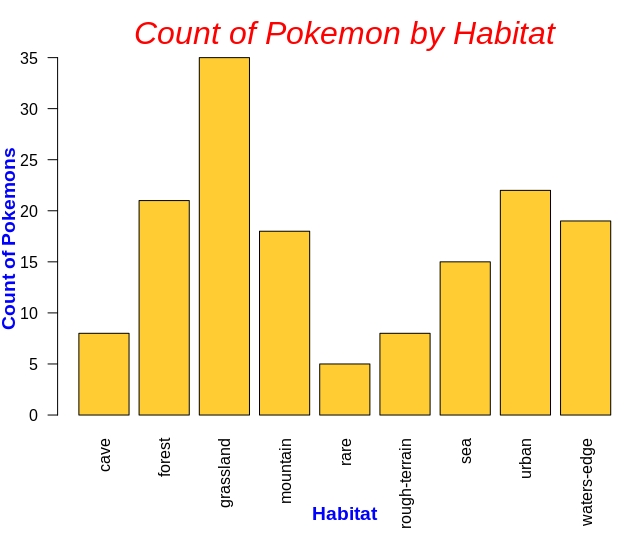

# pokeAPI R Wrapper
### data534_project

This package is an API wrapper in R for https://pokeapi.co/. It is specifically for getting, filtering, and summarizing the following information for each of the generation 1 pokemon.

- pokedex index number (idx)
- pokemon species (pokemon)
- API URL for pokemon species (speciesURL)
- habitat
- type
- top 5 moves (moves)

# pokeWrapper Installation
- Eva could you do this part since you are more familiar with how to install the package? I also think I remember seeing that you had code for installing the package in a file.

```
# Code chunk for the package installation
```

# pokeWrapper Usage
Before anything can be done a data frame (refered to as a pokeframe) storing all of the generation 1 pokemon needs to be created. A pokeframe can be created using the following commands.

```
>>> pokeframe <- initializeDataFrame()
```
## Using the poke.filter Function
As the pokeframe initializes the R Console will show a counter, once the counter reaches 151 (the number of generation 1 pokemon) the pokeframe initialization is complete. Expect this initialization to take approximately 4 minutes.

Once the pokeframe has been initialized the data can be filtered using the `poke.filter()` function for any generation 1 pokemon by passing in a single pokemon, or a list of pokemon. Examples of how this is done are shown below.

```
# Filtering Individual Pokemon at a time
>>> poke.filter(pokeframe, "jigglypuff")
   idx    pokemon                                    speciesURL   habitat captureRate          type                                             moves
58  39 jigglypuff https://pokeapi.co/api/v2/pokemon-species/39/ grassland         170 fairy, normal pound,double-slap,mega-punch,fire-punch,ice-punch

# Filtering Multiple Pokemon at a time
>>> poke.filter(pokeframe, c("pikachu", "bulbasaur", "charmander", "squirtle"))
    idx    pokemon                                    speciesURL     habitat captureRate          type                                                    moves
68   25    pikachu https://pokeapi.co/api/v2/pokemon-species/25/      forest         190      electric          mega-punch,pay-day,thunder-punch,slam,mega-kick
149   7   squirtle  https://pokeapi.co/api/v2/pokemon-species/7/ waters-edge          45         water           mega-punch,ice-punch,mega-kick,headbutt,tackle
150   4 charmander  https://pokeapi.co/api/v2/pokemon-species/4/    mountain          45          fire mega-punch,fire-punch,thunder-punch,scratch,swords-dance
151   1  bulbasaur  https://pokeapi.co/api/v2/pokemon-species/1/   grassland          45 poison, grass               razor-wind,swords-dance,cut,bind,vine-whip
```
### Incorrect Inputs for the poke.filter Function
If an incorrectly spelled pokemon name, or a non-generation 1 pokemon is passed in amoung a list of generation 1 pokemon then only the correctly spelled, or generation 1 pokemon will be filtered for, and a message indicating that some of the pokemon are not from generation 1. If none of the pokemon passed in are from generation 1 a message indicating this will be printed to the R Console.

If the pokeframe passed into the function is not a data frame then a message will be printed on the R Console indicating that the pokeframe must be a data frame. 

## Using the summary Function
The `summary()` function can be used to provide a data frame summary for the following information:

- **Habitat:**
  - Count of pokemon per habitat
  - Mean capture rate per habitat
- **Pokemon Type:**
  - Count of pokemon per type
  - Mean capture rate per type
  
Examples of how to use the summary function are shown below:

```
# Using the habitat option with the summary function
>>> summary(pokeframe, 'habitat')
  habitat       pokemonCount meanCaptureRate
  <chr>                <int>           <dbl>
1 cave                     8             128
2 forest                  21             126
3 grassland               35             111
4 mountain                18              94
5 rare                     5              11
6 rough-terrain            8             140
7 sea                     15             105
8 urban                   22              88
9 waters-edge             19             110

# Using the type option with the summary function
>>> summary(pokeframe, 'type')
   type            pokemonCount meanCaptureRate
   <chr>                  <int>           <dbl>
 1 bug                        3             140
 2 dragon                     2              45
 3 electric                   6             101
 4 fairy                      2              88
 5 fairy, normal              2             110
 6 fairy, psychic             1              45
 7 fighting                   7              96
 8 fighting, water            1              45
 9 fire                      10              96
10 flying, bug                2              45
# … with 28 more rows
```

### Incorrect Inputs for the summary Function
If an incorrect parameter is passed into the summary function a message will be printed in the R Console stating that the request was invalid.

# Plotting with pokeWrapper
The summary data can be plotted through the following steps:

1. Create a pokeframe
2. Run the `summary()` function on the desired parameter and store the resulting data frame
3. Plot the resulting data frame

Code for the above steps and a sample plot for the count of pokemon by habitat are shown below.

```
>>> pokeframe <- initializeDataFrame()
>>> habitatSummary <- summary('habitat')
>>> barplot(habitatSummary$pokemonCount, names.arg=habitatSummary$habitat, las=2,col="#FFCC33")
>>> par(mar=c(7,3,3,0))
>>> mtext(side=3, line=0.5, "Count of Pokemon by Habitat", col="red", font=3, cex=2)
>>> mtext(side=1, line=4.5, "Habitat", col="blue", font=2,cex=1.2)
>>> mtext(side=2, line=2, "Count of Pokemons", col="blue", font=2, cex=1.2)
```

